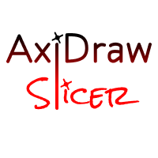

<p align="center">
  
</p>

<h1 align="center">AxiDraw Slicer</h1>

<p align="center">
  A vector slicing, toolpath optimization, and real-time controller interface for <strong>AxiDraw</strong> plotting machines.
</p>

<p align="center">
  Built on a architecture combining a Rust (Tauri) backend with a modern React + TypeScript (Vite) frontend.
</p>

---

## Features

### 1. Prepare tab
*   **Vector & image import:** Drag-and-drop vector SVG files or standard raster images.
*   **Vectorization:** Convert any image into clean vector paths using five built-in algorithms:
    *   *Sketch (Squiggle)*: Continuous wave-like patterns for artistic shading.
    *   *Hatch (Waves)*: Density-modulated wave grids.
    *   *TSP (Traveling Salesperson)*: Generates a single continuous path connecting all points optimally.
    *   *Outline (Line Art)*: Sobel contour outlines for clean line art representation.
    *   *Cross-Hatching (Waves)*: Double-direction density-modulated wave grids for cross-hatch shading.
*   **Workspace manipulation:** Translate, scale, and rotate objects directly on the page grid using interactive mouse handles or numerical input fields.
*   **Auto-arrange:** Automatically arrange multiple designs on the bed compactly, optimizing space and maintaining comfortable margins.
*   **Pen tracker:** Track accumulated drawing distance in meters for standard and custom pen profiles, with depletion warnings when the ink capacity is reached.

<p align="center">
  
</p>

### 2. Preview tab
*   **Drawing sequence slider:** Step through the drawing sequence point-by-point to simulate the exact toolpath before launching the physical plot.
*   **Simulated pen tip cursor:** A virtual pen tip glides along the paths as you slide the timeline, showing the real-time drawing state.
*   **Estimates:** Telemetry calculations for drawing time, drawing distance, air travel distance, travel time, and total pen lift count.

<p align="center">
  
</p>

### 3. Monitor tab  
*   **Dashboard containing:**
    *   *Real-time EBB serial terminal logs* with a manual command line input for raw serial communications.
    *   *Job history & quick relaunch*: Automatic storage of past print jobs with single-click relaunch.
    *   *Live visualizer canvas*: 60 FPS viewport rendering of the physical plotter head movement.
    *   *Statistics tracker*: Real-time updates for elapsed time, distance drawn, travel distance, live air travel time, completed points/paths, and estimated remaining time.
*   **Physical controls:**
    *   *Checkpointed stop*: Pressing Stop halts the plotter by completing the current segment to the nearest path corner (checkpoint) before raising the pen and homing. This prevents mechanical shocks and paper scratches.
    *   *Pause & resume*: Pause and resume printing mid-job.

<p align="center">
  
</p>

---

## Technical architecture

*   **Frontend:** React 18, TypeScript, Vanilla CSS.
*   **Backend & serial driver:**
    *   Serial communication with the EiBotBoard (EBB).
    *   60 Hz real-time coordinate interpolation for smooth manual jogging, homing, and live telemetry tracking.
    *   Optimized Rust native computation for path slicing, TSP solving, and image vectorization.

---

## Installation & setup

### Prerequisites
*   [Node.js](https://nodejs.org/) (version 20+)
*   [Rust & Cargo](https://www.rust-lang.org/) (stable release)
*   Tauri system dependencies (Refer to the [Tauri Getting Started Guide](https://tauri.app/v1/guides/getting-started/prerequisites))

### Running the application

1. Install npm dependencies:
```bash
npm install
```

2. Start the application in development mode:
```bash
npm run tauri dev
```

3. Build the production executable bundle:
```bash
npm run tauri build
```

---

## Keyboard shortcuts

### Workspace tab
*   `Ctrl + C`: Copy the selected object.
*   `Ctrl + X`: Cut the selected object.
*   `Ctrl + V`: Paste the copied object onto the bed.
*   `Delete` / `Backspace`: Delete the selected object.
*   `Ctrl + Mouse Scroll`: Zoom in and out of the canvas grid.
